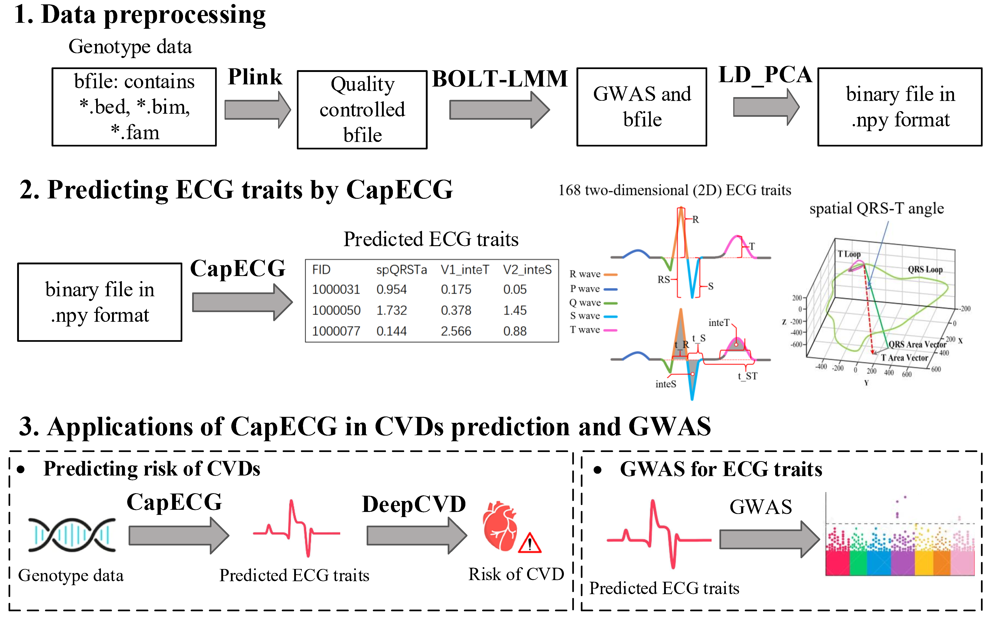

# CapECG: Empowering genetic discoveries and cardiovascular risk assessment by predicting electrocardiograms from genotype in UK-biobank 
CapECG is an attention-based Capsule Network for ECG traits prediction using genotype data. The predicted ECG traits by CapECG can be used to predict cardiovascular diseases (CVDs) risk and perform GWAS.

## Installation

To reproduce **CapECG**, we suggest first create a conda environment by:

~~~shell
conda create -n CapECG python=3.8
conda activate CapECG
~~~

and then run the following code to install the required package:

~~~shell
pip install -r requirements.txt
~~~
### Requirements
- `pytorch(1.8.1)`
- `torchvision(0.9.1)`
- `matplotlib(3.3.4)`
- `pandas(1.1.5)`
- `tqdm(4.62.3)`
- `numpy(1.19.2)`
- `scikit-learn(1.0.2)`
- `scipy(1.6.2)`

PLINK (v1.90) can be downloaded from  https://www.cog-genomics.org/plink/ .

## 1. Data preprocessing

### 1.1 Data Quality Control


PLINK (v1.90) is used to perform quality control for genotype data in bfile format. The result will be saved in "QCedSNPs.qc2". The code is:

```
cd CapECG

plink --bfile QCedSNPs --geno 0.0 --maf 0.01 --hwe 1e-5 midp include-nonctrl  --make-bed --out QCedSNPs.qc1

plink --bfile QCedSNPs.qc1 --het --test-missing midp --pfilter 1e-4 --make-bed --out QCedSNPs.qc2
```

### 1.2 Split data into training-test set

The genotype data pre-processed by PLINK will be split into training-test set. The code is:

```
plink --bfile QCedSNPs.qc2 --keep train_FID.txt --make-bed --out QCedSNPs.qc2.train

plink --bfile QCedSNPs.qc2 --keep test_FID.txt --make-bed --out QCedSNPs.qc2.test
```

### 1.3 GWAS for training data


BOLT-LMM is used to perform GWAS for training data. You need to provide the phenotype file (file_pheno) with FID, IID, age, sex, center, batch and trait. The results will be saved in "file_out". The code of BOLT-LMM for GWAS is availabe at  https://alkesgroup.broadinstitute.org/BOLT-LMM/BOLT-LMM_manual.html, and BOLT-LMM can be run by the code:


```
./BOLT-LMM_v2.3.5/bolt \
--bfile=QCedSNPs.qc2.train --LDscoresFile=file_ld \
--lmm \
--phenoFile=file_pheno --phenoCol=trait \
--covarFile=file_pheno --qCovarCol=age --covarCol=sex --covarCol=center --covarCol=batch --covarMaxLevels=120 \
--modelSnps=file_modsnp \
--statsFile=file_out #QCedSNPs.qc2.train_GWAS.trait
```

### 1.4 Perform LD-PCA analysis


LD-PCA is used to reduce the data dimension using LD information for genotype data in bfile format. The results will be saved in "./data/trait". The code is:

```
python LD_PCA.py --ECG_trait trait \ # indicated ECG trait for prediction
		--GWAS_path QCedSNPs.qc2.train_GWAS.trait \ # GWAS for training data
		--save_dir ./data/trait \ # the path of the folder for saving the results
		--train_FID_path train_FID.txt \ # the list of human ID of training set
		--test_FID_path test_FID.txt \ # the list of human ID of testing set
		--bfile QCedSNPs.qc2 # genotype data in bfile format
```
By running the above command, two files will be generated under specific path: 
- `./data/trait/npy_data/train.npy`: a binary file storing the genotype data in .npy format for training set
- `./data/trait/npy_data/test.npy`: a binary file storing the genotype data in .npy format for testing set

These SNPs are encoded as sample-major additive **(0/1/2)**. Here,“0” refers to homozygous for the reference allele, “1” refers to heterozygous for the alternative allele, and “2” refers to the homozygous for the alternative allele. 

## 2. Training CapECG for ECG traits prediction


The processed genotype data in .npy format are used as input of CapECG.  The code is:

```
python train_CapECG.py  --ECG_trait trait \ # indicated ECG trait for prediction
                --npy_dir  \ # the path of data folder containing two input genotype data (train.npy, test.npy)
                --pheno_path  ./data/file_pheno \ # the phenotype file (file_pheno) with FID, IID, age, sex, center, batch and trait.
		--model_dir # the path of the folder for saving the model parameters
```

## 3. Applications of CapECG in CVDs prediction and GWAS

### 3.1 Use ECG traits to predict cardiovascular disease (DeepCVD)


The predicted ECG traits are input into "DeepCVD_pred.py" to predict the risk of CVDs by running the code:
```
python DeepCVD_pred.py  --CVD CVD \ # the name of cardiovascular disease for prediction
                --ECG_trait_path  ./data/predicted_ECG_traits/feature.csv \ # input ECG traits
                --out ./data/CVD_risk.csv  # output (predicted CVD risk)
```
Running the above command will generate one output file in the output path:
- `./data/CVD_risk.csv`: a table storing the predicted CVD risk. The first column is the human ID, and the second column is the predicted risk of the disease.

The code "DeepCVD_pred.py" is developed for predicting six types of diseases including essential hypertension (EH), angina pectoris (AP), myocardial infarction (MI), ischaemic heart disease (IHD), Atrial fibrillation (AF) and Coronary atherosclerosis (CA). The "CVD" is required input into "DeepCVD_pred.py", which is the short name of disease.


### 3.2 Use ECG traits to perform GWAS analysis


When CapECG has been used in a large population for predicting ECG traits from genotype, the predicted ECG traits is able to be used for GWAS to identify novel SNP assocations. The code of BOLT-LMM for GWAS is availabe at  https://alkesgroup.broadinstitute.org/BOLT-LMM/BOLT-LMM_manual.html, and BOLT-LMM can be run by the code:

```
./BOLT-LMM_v2.3.5/bolt --bfile=file_bfile \ # input genotype data
--LDscoresFile=file_ld \ # input SNP LD data
--lmm \
--phenoFile=file_pheno \ # input ECG trait data
--phenoCol=trait \ # input ECG trait
--modelSnps=file_modsnp \ # input SNP list
--numThreads=nthread \
--statsFile=file_out # output GWAS
```

## Citation

If you find our codes useful, please consider citing our work:

~~~bibtex


@article{
  title={Empowering genetic discoveries and cardiovascular risk assessment by predicting electrocardiograms from genotype in UK-biobank},
  author={Siying Lin, Yuedong Yang, Huiying Zhao*},
  journal={},
  year={2024},
}
~~~
